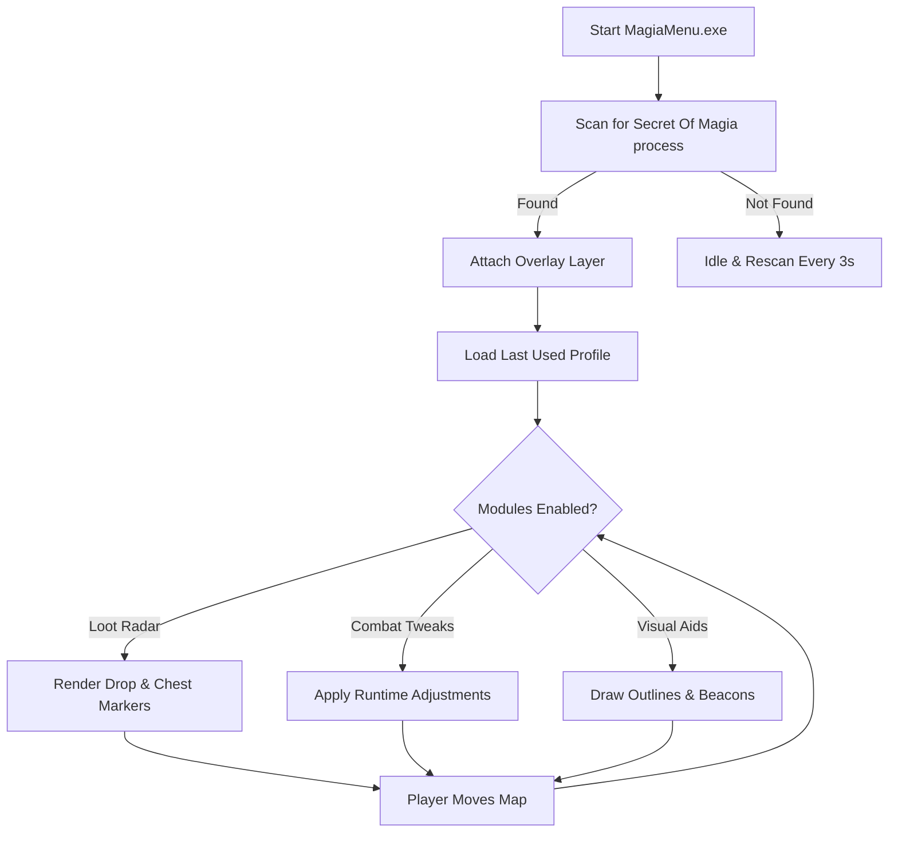

## Overview 🌌

The **Secret Of Magia Mod Menu** is a dedicated desktop tool that attaches to the game process, then paints a subtle overlay on top of your screen. Through it, you can:

* Reveal enemies and chests with **visual outlines**.
* Track drops and rare loot with **radar-style indicators**.
* Tweak damage, cooldowns, and mobility in fine steps.
* Save loadouts as profiles and switch them on the fly.

It’s designed to be **quiet but powerful**: minimal performance impact, minimal clutter, maximal clarity.

> [!WARNING]
> Use the Mod Menu only in single-player or private/co-op scenarios. Avoid competitive online modes where third-party tools may violate terms of service.

---

# FAQ ❓

**Q: What exactly is this Mod Menu?**
A: It’s a Windows overlay that attaches to the running game and exposes configurable modules: combat tweaks, loot visibility, movement helpers, and UI filters, all driven by hotkeys.

**Q: Is it always “on”?**
A: No. Every feature is modular. You decide what’s active—XP gains, vision tools, drop radar—on a per-profile basis.

**Q: Will it change my save files?**
A: The menu focuses on *runtime values* only. It doesn’t rewrite save data, so you can safely switch back to vanilla whenever you wish.

**Q: Does it require scripting knowledge?**
A: Not at all. Profiles are simple JSON files. You can copy, rename, and tweak them with any text editor.

**Q: Can I use it with controllers?**
A: Yes. There’s a hotkey router that lets you bind features to controller combos (e.g., `LT + D-Pad Up`) while keeping keyboard shortcuts active.

---

## Features 👁

### Loot & Awareness Focus

This build leans into **farming and map awareness**, so you can glide through dungeons with calm confidence:

* **Drop Radar:** highlights valuable loot within a configurable radius (e.g., 20–80 meters).
* **Rarity Filters:** show only Uncommon, Rare, or Legendary drops, with adjustable intensity.
* **Chest Beacon:** soft pulse around unopened chests and secret caches.
* **Harvest Overlay:** marks gatherable nodes (ore, herbs, etc.) when they enter your view.

### Combat & Mobility Modules

When fights get tense, a few subtle shifts can change everything:

* **Adaptive Damage Scale:** granular control from `1.05x` up to `1.75x`.
* **Cooldown Dial:** reduce ability cooldowns by 5%–35% in small steps, avoiding wild imbalance.
* **Dash Extension:** expand dash distance by a percentage instead of a flat “teleport.”
* **Hitbox Clarity:** optional outline on your character and nearby enemies to read positioning better.

### Visual & Comfort Options

Because clarity is power:

* **Colorblind-friendly palettes** for outlines and radar.
* Adjustable overlay opacity (0.2–0.9).
* Optional **minimal HUD mode** that hides non-essential elements while Mod Menu highlights stay visible.

---

## Setup ⚡

Installation is built to be as gentle as a campfire tune:

1. **Extract** the download archive to a dedicated folder, e.g. `C:\MagiaModMenu\`.

2. **Right-click** `MagiaMenu.exe` → *Run as administrator*.

3. Start **Secret Of Magia** from Steam or your launcher.

4. Wait for the status line to show `Attached ✔`.

5. Press the default overlay hotkey:

   ```text
   Ctrl + Backspace
   ```

6. Choose a profile (e.g. *Loot_Farmer*, *Boss_Route*, *Chill_Story*) from the left sidebar.

Optional command-line launch with a specific profile:

```bash
MagiaMenu.exe --profile Loot_Farmer --silent-start
```

If you want the menu to remember the last active profile, toggle **“Auto-load last profile”** in *Settings → General*.

---

## Compatibility 🖥

| Component            | Support Level | Notes                                  |
| -------------------- | ------------: | -------------------------------------- |
| Windows 10 (64-bit)  |        ✅ Full | Optimized injection & overlay pipeline |
| Windows 11           |        ✅ Full | Recommended environment                |
| Steam Build          |      ✅ Tested | Auto-scan process attach               |
| Borderless Window    |   ✅ Preferred | Best overlay stability                 |
| Exclusive Fullscreen |     ⚠ Partial | Use fallback overlay mode              |

**Accessibility note:** All colors and outlines can be remapped. Font size in the menu scales from 80% up to 140% for readability.

---

## Advanced Config 🎛

Profiles live in the `/profiles` directory as JSON. Here’s a compact example focused on loot and gentle combat boosts:

```json
{
  "name": "Loot_Farmer",
  "lootRadar": {
    "enabled": true,
    "radius": 55,
    "rarityMinimum": "Rare"
  },
  "combat": {
    "damageScale": 1.25,
    "cooldownReduction": 0.22
  },
  "vision": {
    "enemyOutline": true,
    "chestBeacon": true,
    "gatherNodeHighlight": true
  },
  "keys": {
    "toggleRadar": "F7",
    "toggleCombat": "F8",
    "panicReset": "Ctrl+F12"
  }
}
```

You can keep multiple profiles side by side and switch them during a single session; the menu will blend settings without forcing a reload.

---

## Flow Diagram 🔀

The internal logic is simple but deliberate. Here’s how the suite behaves each time you start it:



This loop ensures the menu stays reactive as you move, fight, and loot—without you having to reopen anything mid-battle.

---

## Profile Tips & Best Practices

* For **fresh playthroughs**, keep `damageScale` under `1.2` so you don’t outpace gear progression.
* Pair **Loot Radar** with slightly reduced cooldowns for a comfy yet engaging farming route.
* Use **panicReset** to immediately revert everything to “vanilla” values when you want a pure story moment.
* Create separate profiles for *daytime exploration* and *boss attempts*; you can tone down radar noise when all you care about is the arena.

---

## Final Thoughts 🚀

In a world of blades and spell sigils, information is its own enchantment. This Mod Menu doesn’t try to rewrite *Secret Of Magia*—it lets you **reshape how you see and pace it**. Clean overlay, thoughtful profiles, and awareness tools tuned for loot hunters, map explorers, and late-night min-maxers alike.

If you’re ready to step into dungeons with clearer vision and a toolbox of toggles at your fingertips, this suite is waiting.
